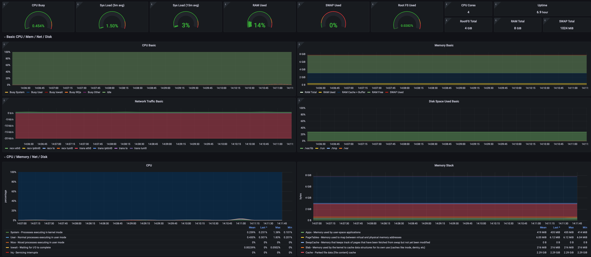
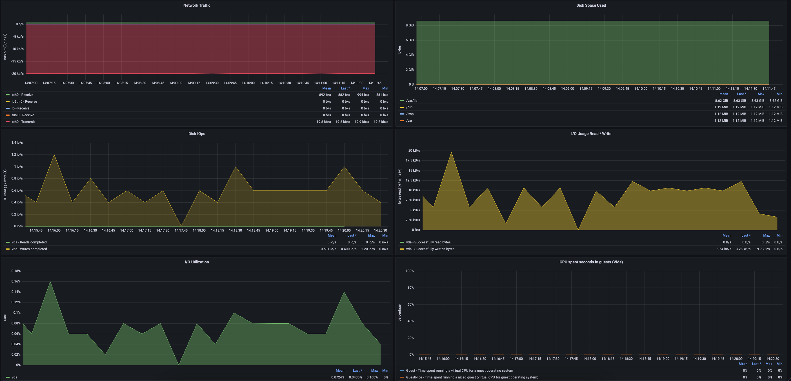

## Hearbit 🔊📊

:heartbeat: Hearbit is an open-source, enterprise-wide observability product that helps you monitor and understand the health of your systems. With Hearbit, you can easily collect, process, and analyze data from your entire infrastructure, including applications, networks, and servers.

# Features

Open-source: Hearbit is open-source, meaning that you can access the source code and make modifications to it as per your needs.

Enterprise-wide observability: Hearbit allows you to monitor and understand the health of your entire infrastructure, including applications, networks, and servers.

Data collection and processing: Hearbit can collect data from various sources and process it to provide you with insights and metrics.

Customizable dashboards: Hearbit provides customizable dashboards that allow you to visualise your data in real-time.

Alerting: Hearbit has built-in alerting capabilities that allow you to set up alerts for specific metrics and events.

# Linux Host Health observability interactive dashboard.



# Getting Started

To get started with Hearbit, you'll need to first install the necessary dependencies and set up your configuration.

1. Clone the Hearbit repository by running the following command:

```
git clone https://github.com/hearbit/hearbit.git
```

